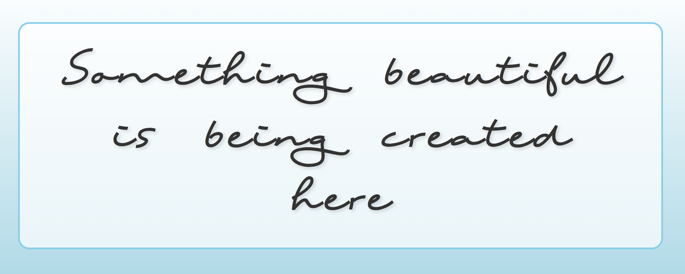

# Beautiful Creation - README

This project is a simple yet stylish HTML page with a centered message.
It uses a custom font ('Ting Tong') and responsive CSS to create an
elegant and modern look.

[Visit the website](https://change-my.com)

## Features

-   Fully responsive design, scales well on desktop and mobile.
-   Uses @font-face for custom typography.
-   Linear gradient background for a soft aesthetic.
-   Shadow and border styling for depth effect.

## Installation

1.  Download or clone this project.
2.  Place the `TingTong.ttf` file in the same folder as the HTML file.
3.  Open the HTML file in a browser.

## Usage

Open the `index.html` file in your browser to view the page.\
The page displays a centered message: *"Something beautiful is being
created here"*
